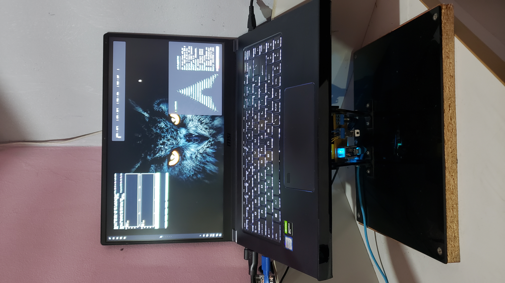
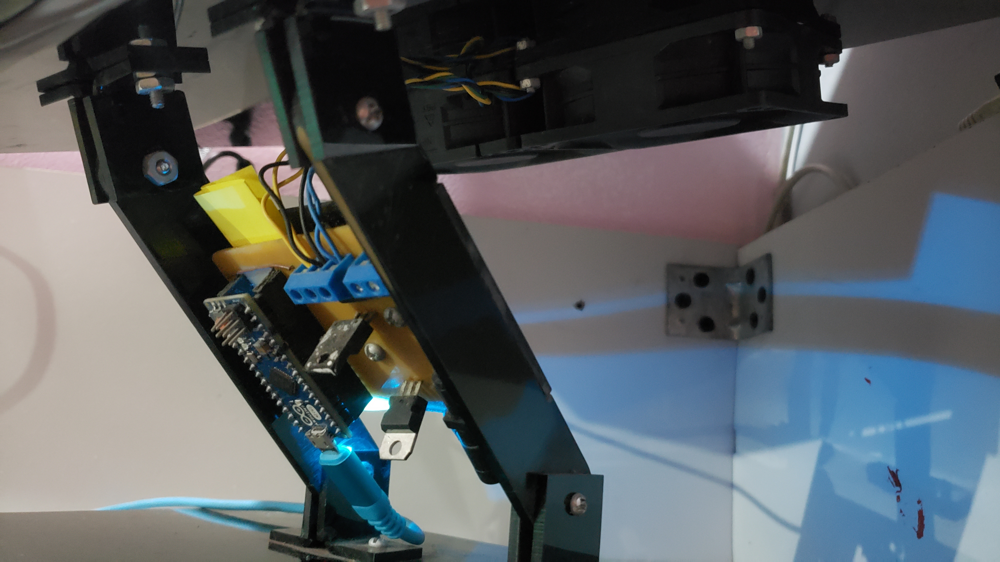

# DracoGlacies

Proyecto de una estación de aire para portátiles

# Hardware

Microcontrolador : `Arduino Micro` 

Fuente de Alimentación  :  `12V` / `2A` 

Ventiladores (Fan) : `12 V` / `700 mA` / `5200 RPM` Cada uno

La PCB de control de los ventiladores su PCB y componentes se pueden observar en la carpeta de `Proteus PDB`  ya que ahí se aloja el proyecto y para abrirlo se es necesario el software de Proteus

# Firmware

Este posee un firmware para el Arduino Micro donde el código fuente de dicho firmware esta en el repositorio, este se comunicara por puerto serial al computador con la velocidad de 9600 baudios.

# Software

El software de control que le entrega la información al micro-controlador esta hecho en dos versiones una para windows 10 y otro para Linux...

## Software para Windows 10

Este posee una interfaz gráfica intuitiva, donde su código fuente esta hecho en lenguaje C#.

El software se encarga de obtener la temperatura del CPU y GPU de la laptop como también detectar la tarjeta de video NVIDIA, con esta información se procede a calcular un valor PWN para los ventiladores y así regular la velocidad de los mismo en función de la temperatura mas alta ya sea la CPU o la GPU.

También cuenta con una fila de barras para configurar el porcentaje de velocidad de los ventiladores en función de la temperatura que se mida en la laptop.

### Instalación 

El lanzador de instalación esta en el repositorio

## Software para Linux

Este no posee una interfaz gráfica, sin embargo, este se ejecuta directamente en un terminal posee un script de instalación como también un archivo de configuracion para ajustar por cuenta del usuario el porcentaje de velocidad de los ventiladores en función de la temperatura.

Este script de ejecución no es necesario ir a la ruta donde este alojado ya que se instala en el sistema solo hay que  usar el siguiente comando y el se ejecutara...

~~~ bash
bash DracoGlacies
~~~

### Instalación

Clonamos el repositorio del proyecto...

~~~bash
git clone https://github.com/St3v3n-4n4/DracoGlacies.git
cd DracoGlacies
~~~

para ejecutar el instalador solo hay que usar el siguiente comando...

~~~bash
bash install.sh
~~~

